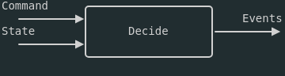
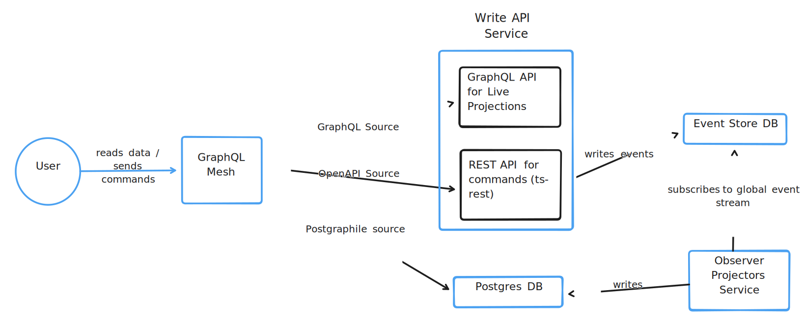

<!--  -->

# **DDD, Event sourcing and CQRS**

A practical guide

---

# End goal

- Different way of thinking about backend.
- How event sourcing can accommodate system evolution be it technical or domain evolution.

## <!-- You will see us mention the word domain alot. We use it to express biz. proccesses and constraints. Your systems should be written as close to the biz. domain as possible. Even the abstractions should mirror operational and biz. abstractions your org uses. -->
---

<!-- # Style.

- Practical considerations and operational and implementation details.
- Philosophical underpinnings that will shape your thought process.
-->


# A little bit about us.

---

# So What is DDD basically?

Align software design closely with the business domain. The goal is to ensure that the code reflects the actual business processes, rules, and language.

<!-- ---

# Ok

و البعدو؟ -->

<!-- This is a very old idea. زي اليقلك الديف لازم يببقا فاهم الbussniess. But we take this a bit further -->

---

# What does software do?

### (mostly...)

<!-- i am looking for that image of the old lady that just says big data-->

It's about modeling reality.
a sequence of immutable facts.

<!--Fundementally all organizational and accounting practicies were doing this for *centries* way before *electricity* was a thing. We just get paid monies becase we allow them to do what they were already good at. But cheaper, faster,bigger and easier.
لما الموظفة تقلك روح اختم من كذا
brother you must understand
you are the RPC.

And when you complain about convuluted paper trail for a gov. operation.

you are complaining about bad system design.

These 2 things are more similar than we give credit for.
-->

---

##### What is Event sourcing?


---

## Why should I care

<!-- - No relational schema: No service data boundaries/ownership.  reduce service interdependancy for read operations. no contracts no circuts no n+1s. everyone is free to read from the event stream  Maybe this point should be discussed later because at the current time they won't be able to imagine it.-->

<!-- as we mentioned. Nothing is new under the sun all domains were once paper based and based on facts written on sheets paper. This is closer to that which allows you to do things more naturally. Your tech team and your operational team will have the same language with minimal drift. -->

- Naturally aligns itself with the domain.
- Requirement evolution is a breeze (:shushing_face: no db migrations)
- No drift between log output and code.
- Pure,replayable,reliable,safe,_accident_ proof.

And performant

---

## Our recent project.

300k events/day. With a single small pod

---

## The basic idea:

<style>
blockquote {
    border-top: 0.1em dashed #555;
    font-size: 60%;
    margin-top: auto;
}
</style>

- Commands are intentions.
- Events are facts.
- Decider looks at the command and the given system state and decides what the next "fact(s)" are going to be.



> [Source: Functional decider by Jeremie Chassaing](https://thinkbeforecoding.com/post/2021/12/17/functional-event-sourcing-decider)

---
### Write model and read model


---
# (The write side): Evolution function and The decider

- For each "entity/service" you are familiar with "service->repository->database"
- Here we define an "aggregate" Each aggregate has it's evolution function that determines it's state from previous events.
- Right now you can think of an aggregate as an entity.
<!-- An aggregate is a transactional boundry. a place where all events in the aggregate are enoguh to infer it's own state. (reasonably) you can have aggregates reacting to other aggregates via reactors. which issue commands. But fundementally aggregates own their own state.-->

---

### In practice: processing commands into new facts.

```typescript
// streamId is entityPrefix-<randomId>
const { events } = await eventStore.readStream(streamId);
const state = events.reduce(evolve, { status: "empty" });

// Either type Left | Right. Success Or failure
const decideResult = decide(command, state);
if (isLeft(decideResult)) {
  return unwrapEither(deciderResult);
}

const resultEither = await eventStore.appendToStream(
  streamId,
  unwrapEither(decideResult)
);
```

## <!--This is your service". -->
---
## Reactors,policy and system state, read models.

- How one would run things that span different "entities"? Say a "order received,payment received,order confirmed?"

---


## <!-- Somewhere. And not exactly sure where that where is. the distinction should be drawn between aggregate and entity -->

---

#### decide ex:1

```typescript
      match(state,command).with(
        {
          command: { type: "AssignedFrsAddFr" },
          state: { status: "planned" },
        },
        ({ command: { data } }) =>
          makeRight({
            type: "TrafficCounts.Survey.AssignedFRs.FRAdded",
            data,
          }),
      )

```

---

#### decide ex:2

```typescript
      match(state,command).with(
        {
          command: {
            type: "ReserveSegmentModePair",
          },
          state: {
            status: P.union("planned", "inProgress"),
          },
        },
        ({ command: { data }, state }) =>
          match(state.segmentModePairsReservations)
            .with(
              { [data.segmentId + data.modeId]: { available: false } },
              () =>
                makeLeft({ type: "ALREADY_RESERVED" as "ALREADY_RESERVED" }),
            )
            .otherwise(() =>
              makeRight({
                type: "TrafficCounts.Survey.SegmentModePairReservations.PairReserved",
                data,
              }),
            )),
```
<!--In memory data structure FTW-->
---

## Projections


---

## Projections 2
They can be in-memory even.

---

# Eventual consistency
- The read model technically lags behind the write model
- Solution: The API only accepts commands when the client sends the latest event-id within the aggregate’s stream
---

# No 'Database' per service. Everyone owns the data

No relational schema means no need for service data boundaries/ownership. Reduce service interdependence for read operations. 

<!--This-->
---

### Other concerns for a production system

- Event versioning and upgrades.
- Easily spin up different views for different needs.
- Live projections (:thinking:)
- Efficiently projecting a large event stream.

<!-- no contracts no circuts no n+1s. everyone is free to read from the event stream  Maybe this point should be discussed later because at the current time they won't be able to imagine it.-->


---


---